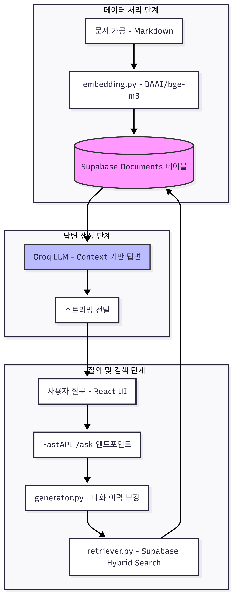
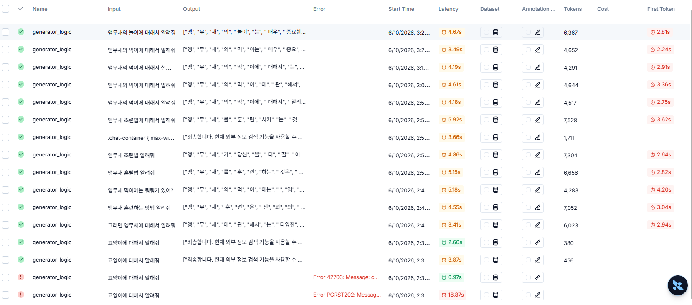
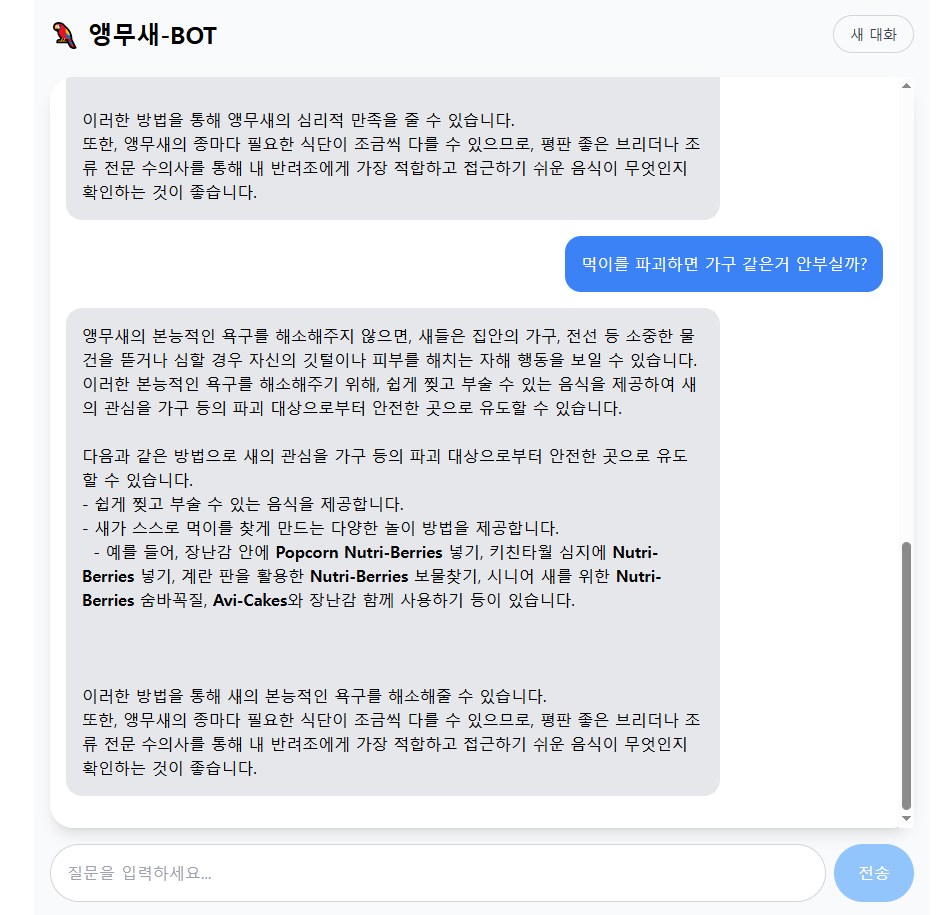
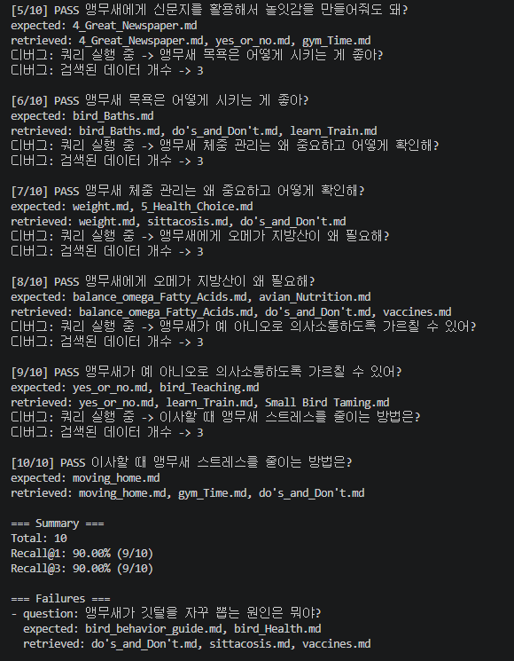

# Parrot RAG Chatbot

## 프로젝트 명

# 앵무새 BOT

앵무새 관련 문서를 기반으로 질문에 답변하는 RAG 챗봇 프로젝트입니다.

세상에 개나 고양이를 위한 프로젝트는 많습니다.

하지만 앵무새를 사랑하는 사람도 있기 마련입니다.

저는 그런 사람들을 위해 Parrot RAG 프로젝트를 기획하였습니다.

PDF/Markdown 문서를 임베딩해 Supabase에 저장하고, 사용자의 질문이 들어오면 hybrid search로 관련 문서를 검색한 뒤 Groq LLM으로 한국어 답변을 생성합니다. React 프론트엔드는 FastAPI 서버의 스트리밍 응답을 받아 채팅 UI로 보여줍니다.

## 주요 기능

- 앵무새 관련 문서 기반 질의응답
- Supabase RPC 기반 hybrid search
- `BAAI/bge-m3` 임베딩 모델 사용
- Groq `llama-3.3-70b-versatile` 기반 답변 생성
- FastAPI `StreamingResponse`를 통한 답변 스트리밍
- React + Vite + Tailwind 기반 채팅 UI
- 대화 이력을 활용한 후속 질문 검색 보강
- 내부 문서 정보가 부족할 때 Tavily 웹 검색 fallback
- 검색 품질 평가 스크립트 제공

## 기술 스택

### Backend


### Frontend


## 프로젝트 구조

```text
.
├── main.py
├── backend
│   ├── data
│   │   ├── raw
│   │   └── processed
│   └── scripts
│       ├── embedding.py
│       ├── generator.py
│       └── retriever.py
├── frontend
│   ├── src
│   │   ├── App.tsx
│   │   ├── main.jsx
│   │   └── index.css
│   └── package.json
└── test
    ├── eval_questions.json
    ├── eval_retriever.py
    ├── search_test.py
    └── test_embed.py
```

## RAG 동작 흐름



개선된 RAG 파이프라인은 다음 순서로 동작

1.  **문서 전처리 (임베딩)**
    - `embedding.py` 스크립트가 `backend/data/processed` 폴더의 Markdown 문서를 읽어들임.
    - `MarkdownHeaderTextSplitter`를 사용해 문서를 제목 기준으로 의미있는 작은 조각(Chunk)으로 분할.
    - `BAAI/bge-m3` 모델로 각 조각을 임베딩하여 Supabase `documents` 테이블에 저장.
2.  **검색 및 답변 생성 (추론)**
    - 사용자가 React UI에서 질문을 입력.
    - `(HyDE)`: `retriever.py`가 LLM을 통해 질문에 대한 '가상의 답변'을 생성.
    - 이 가상 답변을 임베딩하여 초기 검색의 정확도를 높임.
    - `(하이브리드 검색)`: 가상 답변 벡터와 사용자 원본 질문 텍스트를 함께 사용해 Supabase에서 관련성이 높은 문서 조각 후보군 10개를 검색.
    - `(리랭킹)`: `BAAI/bge-reranker-large` 모델을 사용해 10개 후보군의 순위를 재조정하여 최종 3개를 선택.
    - `generator.py`가 최종 선택된 문서 조각들을 컨텍스트로 사용하여 Groq LLM(`llama-3.3-70b-versatile`)에게 답변 생성을 요청.
    - 답변은 스트리밍으로 프론트엔드에 전달.

## 성능 개선 과정

초기 RAG 파이프라인의 검색 정확도(Recall)가 약 14%로 낮게 측정되어, 다음과 같은 단계적 개선 작업을 진행.

### 1. 문서 분할 (Chunking) 도입

- **문제점**: 기존에는 문서를 파일 통째로 임베딩하여, 정보가 너무 많고 희석되어 구체적인 질문에 대한 정확한 문서 검색이 어려움.
- **해결책**: `embedding.py`에 `MarkdownHeaderTextSplitter`를 적용하여, 문서를 제목/소제목 기준으로 의미있는 작은 조각(Chunk)으로 분할하여 데이터베이스에 저장.
- **결과**: 검색 정확도가 약 **20%** 로 소폭 상승.

### 2. 리랭킹 (Re-ranking) 도입

- **문제점**: 초기 검색 결과에 정답이 포함되어 있어도, 가장 관련성 높은 문서가 1위로 오지 않는 경우가 많음.
- **해결책**: `retriever.py`를 수정하여, 초기 검색에서 10개의 후보군을 확보한 뒤 `BAAI/bge-reranker-large` 모델로 순위를 정밀하게 재조정하여 최종 3개를 선택하도록 변경.
- **결과**: `Recall@3` 점수가 **24%** 로 추가 상승하여, 검색 결과의 상위권 정확도가 개선됨을 확인.

### 3. HyDE (Hypothetical Document Embeddings) 적용

- **문제점**: 사용자의 질문이 짧거나 모호할 경우, 검색 의도를 파악하기 어려움.
- **해결책**: `retriever.py`에 HyDE 기법을 적용했습니다. LLM이 사용자의 질문을 바탕으로 '가상의 이상적인 답변'을 생성하고, 그 가상 답변의 임베딩을 사용해 검색함으로써 초기 검색 후보군의 품질을 높였다.
- **목표**: '문서 분할 + HyDE + 리랭킹'의 최종 파이프라인을 통해 검색 정확도를 60% 이상으로 끌어올리는 것을 목표로 한다.

## 환경 변수

루트의 `.env.example`을 복사해 `.env` 파일을 만들고 값을 설정

```powershell
copy .env.example .env
```

```env
SUPABASE_URL=
SUPABASE_SERVICE_KEY=
DATABASE_URL=
GROQ_API_KEY=
LANGSMITH_KEY=
TAVILY_API_KEY=
```

## 실행 방법

### Backend

```powershell
.\venv\Scripts\uvicorn.exe main:app --reload
```

기본 서버 주소:

```text
http://localhost:8000
```

### Frontend

```powershell
cd frontend
npm install
npm run dev
```

프론트엔드 / 백엔드를 한 번에 실행:

```powershell
cd frontend
npm run start-all
```

## 문서 임베딩

Markdown 문서 Supabase에 저장:

```powershell
.\venv\Scripts\python.exe backend\scripts\embedding.py
```

문서는 `backend/data/processed`의 `.md` 파일

## 검색 품질 평가

검색 성능은 `test/eval_questions.json`의 질문-기대문서 평가셋으로 측정

```powershell
.\venv\Scripts\python.exe test\eval_retriever.py
```

API 사용량 제한으로 전체 테스트가 어려울 경우, `--limit` 인자를 사용하여 테스트할 질문의 개수를 지정

```powershell
# 20개의 질문만으로 테스트 실행
.\venv\Scripts\python.exe test\eval_retriever.py --limit 20
```

이 평가는 RAG 파이프라인의 각 개선 단계(Chunking, HyDE, Re-ranking)가 검색 성능에 미치는 영향을 측정하고, 실패 사례를 분석하여 추가 개선 방향을 설정하는 데 사용

## 랭스미스(LangSmith)를 통한 RAG 모니터링



## 실행 화면

### 채팅 UI



### 검색 품질 평가



## 주요 트러블슈팅

### 후속 질문 검색 실패

사용자가 "이게 왜 중요한데?"처럼 짧은 후속 질문을 하면 검색기가 현재 질문만 보고 검색해서 결과가 0개가 되는 문제

이를 해결하기 위해 `generator.py`에서 최근 대화 이력과 현재 질문을 합쳐 검색용 query 생성

```python
retrieval_query = f"{history_text}\n현재 질문: {query}" if history_text else query
context_docs = retriever_logic(retrieval_query)
```

답변 생성에는 원래 사용자 질문을 그대로 사용하고, 검색에만 보강된 query를 사용

### UI 줄바꿈과 말풍선 크기

LLM 답변에 줄바꿈이 포함되어도 React 화면에서는 한 줄로 접혀 보이는 문제

메시지 말풍선에 Tailwind를 수정하여 해결

```tsx
whitespace-pre-wrap break-words w-fit max-w-[80%]
```

### 문서 출력 문제

#### Markdown 굵게 표시

LLM이 `**중요 키워드**` 형식으로 답변했지만 화면에는 `**`가 그대로 보임.

React에서 메시지 렌더링 시 `**텍스트**`를 `<strong>`으로 변환하도록 처리

#### 괄호 제거 문제

백엔드 출력 필터 정규식에서 괄호가 허용되지 않아 `채집 활동(Foraging)`이 `채집 활동Foraging`처럼 붙어 출력

정규식 사용하여 `()`를 추가해 해결

```python
r'[^가-힣a-zA-Z0-9\s.,!?\n*\-()]'
```

## 앞으로 개선할 점

- 답변 하단에 참고 문서 출처 표시
- 평가 질문셋을 20~30개 이상으로 확장
- 실패 케이스 기반 문서 chunking 개선
- Supabase `hybrid_search` score 반환값 정리
- 필요 시 LLM 기반 query rewrite 도입
- 배포 환경 구성
